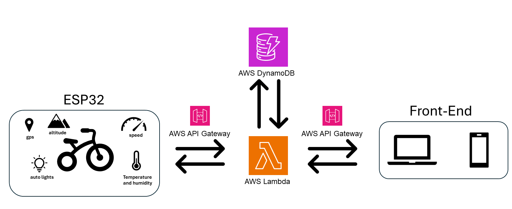
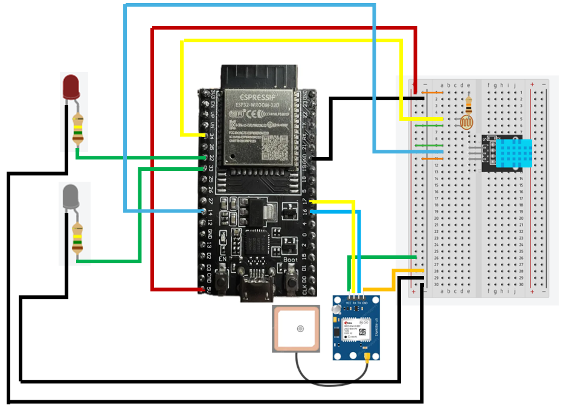

**Project Title**:  Smart Bike Companion   
**Team Name**: rIoT Solutions  
**Team**: Avary McCormack  

# Content
- [Executive Summary](#executive-summary)
- [Project Description](#project-description)
- [Project Timeline](#project-timeline)
- [Conclusion](#conclusion)
- [Team](#team)
- [References](#references)

# Executive Summary
My project was designed with the goal to provide conveniences to bikes and scooters that tend to be reserved for cars such as safety features, data collection, and real-time monitoring. The ESP32 microcontroller is able to communicate through a WebSocket connection via Amazon Web Services (AWS) with smart devices in order to provide information to a front-end interface where users may interact with the sensors and features. On the backend, I wrote a Lambda function to manage data flow, while a database (DynamoDB) was used to store historical sensor data for insightful graphs. Additionally, real-time GPS monitoring and automatic lighting systems add practicality and safety, with a map interface providing users with location and vehicle status. In this project, I designed and coded all parts: ESP32, back-end handler, and front-end.  

# Project Description
### Hardware
- ExpressIf ESP32 - this is the microcontroller that handles reading the sensors and sending data through a WebSocket connection
- Photoresistor (GM5539) - this sensor tracks how bright it is 
- Temperature/Humidity sensor (DHT11) - this sensor records humidity, temperature, and heat index
- GPS (NEO-6M) - this is the gps module that will provide location information, speed, and altitude
- LEDs - can be switched on by the user manually or automatically
- wires, resistors, breadboard 
### Software
- ESP32 software (C++) - The ESP32 software I wrote will connect the ESP32 to WiFi, followed by connecting to the WebSocket conneciton. Then it will read all sensor values and send them through the WebSocket connection. It also has logic to handle incoming messages such as to switch LEDs. 
- WebSocket (AWS API Gateway) - connection protocol used to communicate with ESP32, back-end, and front-end 
- Back-end (node.js | uploaded as Lambda Function) - Created to handle logic from ESP32 and front-end. The back-end works with the database to provide persistent safely stored data. This code processes and stores the ESP32 data and sends it to the front-end. This code also handles any logic the front-end may send such as retrieving/updating specific values. 
- Front-End (typescript | Vite + React) - what I used to create the dashboard with.  A control panel was created to display all sensor readings to users. The front-end also has a map indicating the user's location and vehicle's location. It also has toggles for users to control different modes: 
  - Automatic Light Mode - when activated, lights will turn on automatically when it is dark outside or night time hours
  - Manual Light Mode - when activated, lights will turn on no matter the time or brightness
  - Parking Mode (GPS Monitoring) - when activated, the vehicle's gps location will be saved, the live monitoring will begin, and if the vehicle's newly recorded coordinates begin to move drastically, alerts will be issued for the user. If a user forgets to turn off this mode, this mode will automatically detect if a user is nearby and likely with the vehicle.   

  Along with the map, toggles, and reading displays, I also included the ability for users to view past data through graphs.The old sensor data is stored on the database and is retrievable in order to display graphs for the following values: temperature, humidity, heat index, altitude, and speed. All graphs have the capability of selecting pre-set intervals to display data (such as 'last 24 hours')

- Amazon Web Services (AWS) - what I used for WebSocket, back-end, and map API
  - DynamoDB
  - API Gateway
  - Lambda Functions
  - Amazon Location Map

## Architecture Designs

# Project Timeline
- Month 1- Finalize idea and begin researching and experimenting with hardware
- Month 2 - Collecting needed hardware. Beginning ESP32, front-end, and WebSocket development and testing
- Month 3 - More back-end development along with database involvement
- Month 4 - Testing the integration of all components and preparing reports

# Team
- Avary McCormack

# Conclusion
My project focused on enhancing the cycling experience through the integration of advanced technologies and features. By incorporating automatic lights, GPS monitoring, and real-time data transmission, this project aims to improve safety and security for cyclists. Users can now enjoy a safer riding experience with enhanced visibility and real-time location tracking. The project successfully implemented sensor readings for temperature, humidity, and other environmental metrics. These readings, along with historical data stored in a database, enable efficient data collection and analysis, providing valuable insights for users. Through WebSocket communication and a user-friendly front-end interface, cyclists have access to real-time monitoring and visualization of sensor readings, graphical representations, and interactive maps. This enhances situational awareness and facilitates informed decision-making during rides. Overall, my project represents a step toward leveraging technology to improve the safety, convenience, and enjoyment for cyclists. 